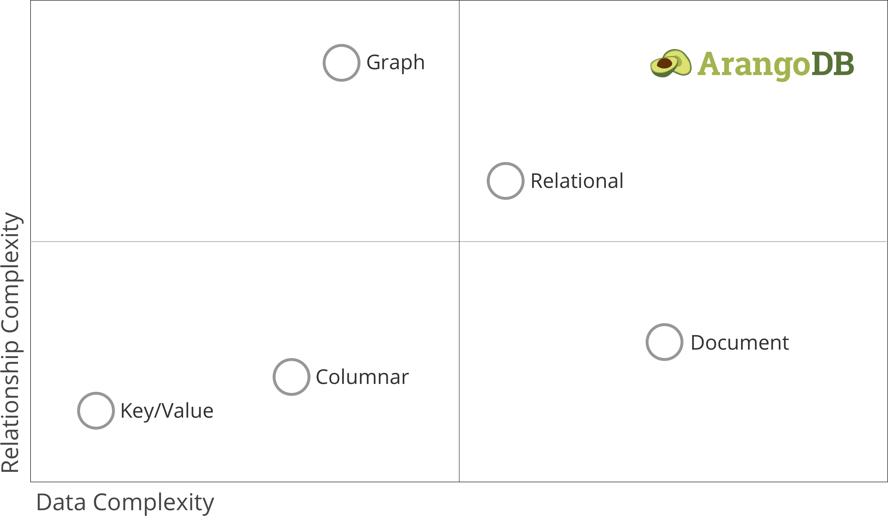

# Let's have a look at


----

# What is it?

----

## Multi-model highly available NoSQL database

> ‟One engine. One query language. Multiple models„

----



---

```bash
docker run
  -p 8529:8529
  -e ARANGO_ROOT_PASSWORD=openSesame
  arangodb/arangodb:3.4.7
```