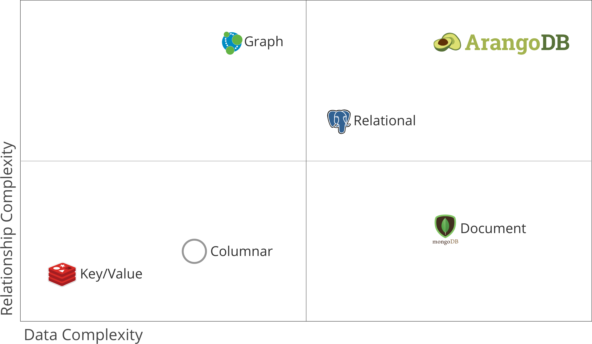

# Let's have a look at


----

# 👋 Hi, I'm Stetson

_**~~Product Architect~~**_

Data Governance

----

# 🚨 Disclaimer 🚨

----

# What is it?

----

### Multi-model highly available NoSQL database

> ‟One engine. One query language. Multiple models„

----

# Okay, but what is it?

----



---

### What does Multi-Model mean?

----

Can be used as a __Graph Database__ or a __Document Store__.

----

Notable Features: __Full text search__, __Geo-spacial search__, __Embedded Node.js Runtime (Foxx)__

----

### "Doesn't that mean it's slow?"

----

## Nope
[](https://www.arangodb.com/2018/02/nosql-performance-benchmark-2018-mongodb-postgresql-orientdb-neo4j-arangodb/)

---

# Yay Docker!

```bash
|src/
|--run_arango.sh # Runs the ArangoDB container

#!/bin/bash

docker run
  -p 8529:8529
  -e ARANGO_ROOT_PASSWORD=openSesame
  arangodb/arangodb:3.4.7
```

---

# Document Store

```bash
# Initialize people collection
yarn document || npm run document

|src/
|--scripts/
|----init-database.js # Creates the database
|----init-people.js # Creates a new document collection
```

----

### init-database.js

```javascript
const { database, databaseName } = require('./helper')

;(async function () {
  try {
    console.log(await database.createDatabase(databaseName))
  } catch (error) {
    console.log(`🚨 ${error}`)
  }
})()
```

----

### init-people.js

```javascript
...

database.useDatabase(databaseName)
const addPeopleQuery = {
  query: `
    FOR person IN @fakePeople
      INSERT person INTO @@collection
  `,
  bindVars: { fakePeople, '@collection': 'people' }
}

await database.collection('people').create()
await database.query(addPeopleQuery)

...
```

----

# demo

---

# Full Text Search

```bash
# Initializes a new ArangoSearchView
yarn view || npm run view

|src/
|--scripts/
|----init-view.js # Creates a new view
```

----

### Hacker Schema

```javascript
{
  firstName: 'Emmanuel',
  lastName: 'Goldstein',
  alias: 'Cereal Killer',
  mantra: `When I was a child, I spake as a child,
    I understood as a child, I thought as a child:
    but when I became a man, I put away childish things!`
}
```

----

### init-view.js

```javascript
...

// Create a new view
const view = database.arangoSearchView('watchlist')
await view.create()
const link = {
  includeAllFields: true,
  fields: { mantra: { analyzers: ['text_en'] } }
}
await view.setProperties({
  links: { hackers: link }
})

...
```

----

# demo

---

# What does the


# say?

----

# What is Foxx?

----

**Foxx ~ Node.js**

>ArangoDB allows application developers to write their data access and domain logic as microservices running directly within the database with native access to in-memory data.

----

# 🧼 📦 🕓

----

# Caveats

----

### All code must be _synchronous_

~~`setTimeout`~~, ~~`Promises`~~, ~~`async/await`~~

----

### No native module support


----

### Doesn't support all of Node.js core

[](https://www.arangodb.com/docs/stable/appendix-java-script-modules.html)

---

# Let's build our first


----

### What makes a service?

```bash
|src/
|--"microservices"/
|----hacker-phrase-search/
|------index.js # The actual code
|------manifest.json # Some info ArangoDB needs
|------README.md # README for the service
|------service.zip # Zipped service files
```

----

### Example service

```javascript
'use strict'
const createRouter = require('@arangodb/foxx/router')
const router = createRouter()

module.context.use(router)

router
  .get('/hello-world', function (req, res) {
    res.send('Hello World!')
  })
  .response(['text/plain'], 'A generic greeting.')
  .summary('Generic greeting')
  .description('Prints a generic greeting.')
```

----

### manifest.json

```json
{
  "name": "watchlist-search",
  "version": "1.0.0",
  "author": "Stetson Pierce",
  "description": "...",
  "engines": {
    "arangodb": "^3.0.0"
  },
  "main": "index.js"
}
```

----

### index.js

```javascript
...

router
  .post(...) // Implement the endpoint
  .body(...) // Describe the POST body
  .description(...) // Describe the enpoint

...
```

----

### index.js - *post*

```javascript
router
  .post('/search', (req, res) => {
    const { phrase } = req.body
    const query = aql`
      FOR suspect IN watchlist
        SEARCH PHRASE(suspect.mantra, ${phrase}, 'text_en')
        RETURN suspect
    `

    const result = db._query(query)
    res.send(result)
  })
```

----

# demo

---

# Thank You
